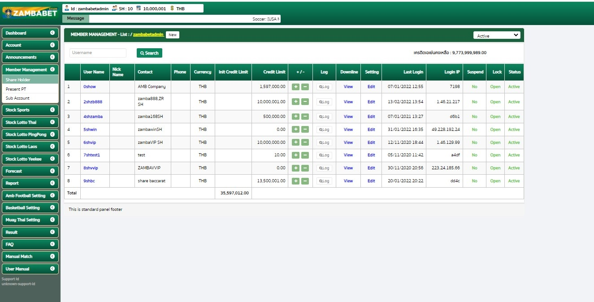
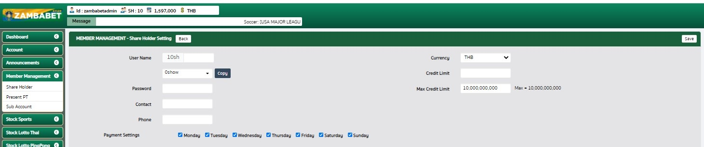

# Organize Management

## การสร้างและแก้ไข Downline ได้เฉพาะใต้ตัวเอง 1 เลเวล

## Menu

- [Register Downline](#register-downline)
- [Downline](#downline-company-share-holder-senioragent)
- [Member](#member)

---

## Register Downline

การสร้าง Downline เป็น Step ดังนี้

- สร้าง Downline
  
- [สร้างสำเร็จให้ Redirect ไปยัง Downline Profile หรือ Setting](#downline-profile-aka-downline-setting)
  
  

---

## Downline (Company, Share Holder, Senior/Agent)

- [สร้าง Downline](#สร้าง-downline)
- แสดงรายการ Downline ของ User นั้น ๆ
- แก้ไขเพิ่มลด Credit และดูประวัติการเพิ่มลด Credit
- คลิ๊กที่ Username กับ Edit จะไปหน้า Downline Profile เพียงแต่หน้า Edit จะสามารถแก้ไขได้
- คลิ๊กที่ View จะดู Downline ของ user นั้น ๆ
  - สามารถเข้าไปดูได้จนถึง Member ภายใต้ User นั้น ๆ
- ระบบค้นจะไปเฉพาะ Level Member

เมื่อคลิ๊ก 🔍 Log ให้โชว์ Modal ตามภาพ

---

## Member

- agent.bet-kub.com จะเป็น Referrence
- โชว์ Detail ของ User ตัวเองหากมี
- แสดงเฉพาะ Member ของ User นั้น ๆ ไม่รวมภายใต้ Downline
- มีปุ่มสร้าง Member ภายในหน้า

